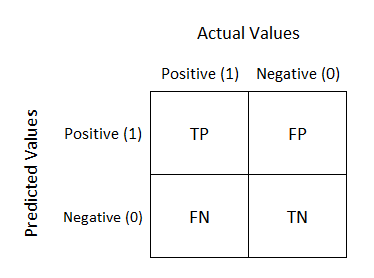
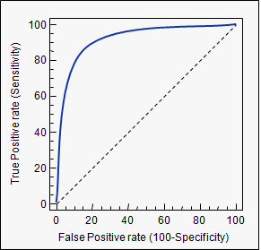
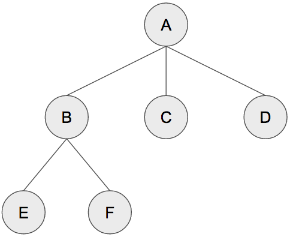
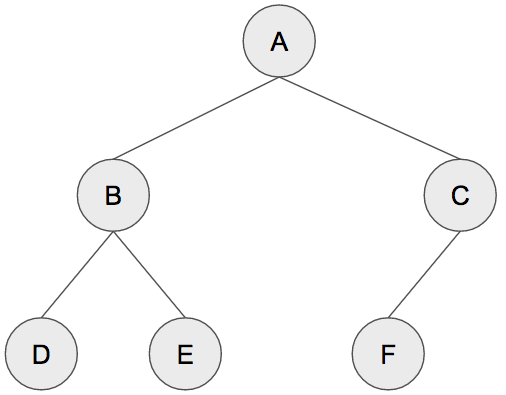

\newpage

# **Introduction**

This project has the aim to analyze the Heart Disease dataset to build a 
classifiers to predict whether people have heart disease or not.

The dataset used for project comes from Kaggle website:
https://www.kaggle.com/ronitf/heart-disease-uci


Attribute Information:

1. age: The person’s age in years
2. sex: The person’s sex 
    * 1 = male,
    * 0 = female
3. cp: The chest pain experienced 
    * Value 1: typical angina, 
    * Value 2: atypical angina, 
    * Value 3: non-anginal pain, 
    * Value 4:   asymptomatic
4. trestbps: The person’s resting blood pressure (mm Hg on admission to the hospital)
5. chol: The person’s cholesterol measurement in mg/dl
6. fbs: The person’s fasting blood sugar 
    * if > 120 mg/dl, 1 = true; 0 = false
7. restecg: Resting electrocardiographic measurement 
    * 0 = normal, 
    * 1 = having ST-T wave abnormality, 
    * 2 = showing probable or definite left 
     ventricular hypertrophy by Estes’ criteria
8. thalach: The person’s maximum heart rate achieved
9. exang: Exercise induced angina 
    * 1 = yes; 
    * 0 = no
10. oldpeak: ST depression induced by exercise relative to rest 
    (‘ST’ relates to positions on the ECG plot)
11. slope: the slope of the peak exercise ST segment 
    * Value 1: upsloping 
    * Value 2: flat, 
    * Value 3: downsloping
12. ca: The number of major vessels (0-3)
13. thal: A blood disorder called thalassemia 
    * 1 = normal; 
    * 2 = fixed defect; 
    * 3 = reversable defect
14. target: Heart disease 
    * 0 = no
    * 1 = yes

In this project "target" are going to be the dependent variable. The others
attributes are going to be the predictors.

This project will make a comparison between different machine learning algorithms 
in order to to assess the correctness in ***classifying*** data with respect 
to efficiency of each algorithm in terms of ***sensitivity*** and ***specificity***.

***Sensitivity*** and ***specificity*** are widely used in medicine for binary 
classification test.

We are going to project a ***Machine Learning Classifiers***, more 
specifically a ***Binary classifiers*** where the two classes are:

1. yes: Heart disease
2. no: No Heart disease


\newpage


# **Methods**

## Key concepts

***Classification***
Classification is the process of predicting the class of given data points. 
When there are only two classes the problem is known as ***statistical binary classification***.

***Accuracy*** and ***Kappa***
These are the default metrics used to evaluate algorithms on binary and 
multi-class classification datasets in caret.

***Accuracy*** is the percentage of correctly classifies instances out of all 
instances. It is more useful on a binary classification than multi-class 
classification problems because it can be less clear exactly how the accuracy 
breaks down across those classes.

***Sensitivity*** is the true positive rate also called the recall. 
It is the number instances from the positive (first) class that actually 
predicted correctly.

***Specificity*** is also called the true negative rate. Is the number of 
instances from the negative class (second) class that were actually 
predicted correctly

***Confusion Matrix***
Confusion Matrix is represented by the following table

<center>



</center>


1. TP: True positive
2. FP: False positive
3. FN: False negative
4. TN: True negative

A true positive is an outcome where the model correctly predicts 
the positive class.

A false positive is an outcome where the model incorrectly predicts 
the positive class.

A false negative is an outcome where the model incorrectly predicts 
the negative class.

A  true negative is an outcome where the model correctly predicts 
the negative class.

Now we consider these rates

$$
\mbox{TPR} = \frac{TP}{TP+FN}
$$

$$
\mbox{FPR} = \frac{FP}{TN+FP}
$$

TPR (True Positive Rate, that correspond to Sensitivity) means how often does 
the classifier correctly predict positive.

FPR (False Positive Rate) means how often does the classifier incorrectly 
predict positive. FPR also correspond to: 100% - Specificity, where Specificity 
is the proportion of true negative who are correctly identified.

***ROC*** (Receiver Operating Characteristic) Curve is a way to visualize
the performance of a binary classifier.

The ROC metric is strictly connected with Confusion Matrix

The ROC metric is better explained by ROC curve where TPR is on y axis and 
TFR on x axis.

<center>



</center>

The dotted line correspond to the random classification, so a good classification
is showed by any curve (like the blue one) up the dotted line.

The area under the ROC curve is also called: ***AUC*** (Area Under Curve)

***Covariance*** of two statistical variables is a number that provides a 
measure of how much the two vary together.

***Covariance matrix*** is a generalization of ***covariance*** to the case of 
dimension greater than two.

***Supervised learning*** is a machine learning technique that aims to train a 
computer system in order to allow it to autonomously make predictions on the 
output values of a system versus an input based on a series of ideal examples, 
consisting of pairs input and output, which are initially provided..

***Unsupervised learning*** is a type of machine learning that looks for 
previously undetected patterns in a dataset with no pre-existing labels and 
with a minimum of human supervision. Unlike supervised learning which usually 
makes use of human-labeled data, unsupervised learning allows for the modeling 
of probability densities on inputs.

***The Bayes theorem*** describes the probability of an event, based on 
the preliminary knowledge of the conditions that could be related to the event.
It serves as a way to understand ***conditional probability***.

***The conditional probability*** of an event *A* with respect to an event *B* 
is the probability that *A* will occur, knowing that *B* has occurred. 
This probability, indicated ${\ P (A | B)}$ 
or ${\ P_ {B} (A)}$, 
expresses a "correction" of expectations for *A*, dictated by observation of *B*.

***Naive Bayes*** is a ***supervised learning algorithm*** suitable for solving 
binary (two-class) and multi-class classification problems. The main peculiarity 
of the algorithm, in addition to making use of ***the Bayes theorem***, is that 
it is based on the fact that all the characteristics are not related to each other.

***Ensemble model*** is a combination of single simple models 
(called weak learners) that together create a new, more powerful model 
(called strong learner).

***Boosting*** is an ***ensemble method*** for improving model predictions of a given 
learning algorithm. The idea behind it is to train weak learners sequentially, 
each trying to correct its predecessor.

***Loss function*** is a method for estimating the quality of an algorithm in 
modeling the data provided. If the forecast deviates too much from actual 
results, the loss function produces a very large number.

***Bagging*** is an ***ensemble model***. Is a general procedure that can be 
used to reduce the variance of those algorithms that have a high variance.

***Collinearity*** is a linear association between two predictors. 
***Multicollinearity*** is a situation where two or more predictors are highly 
linearly related that it can lead to misleading results when attempting 
to predict the dependent variable.

\newpage

## Model evaluation

### Metrics To Evaluate Machine Learning Algorithms

The metric used for these project is ROC.

AUC is the area under the ROC curve and represents a models ability to 
discriminate between positive and negative classes. 
An area of 1.0 represents a model that made all predicts perfectly. 
An area of 0.5 represents a model as good as random. 

ROC can be broken down into sensitivity and specificity. 
A binary classification problem is really a trade-off between sensitivity 
and specificity.

To calculate ROC information, in our trainControl we must set the summaryFunction  
to twoClassSummary. 


### Principal component analysis

Principal component analysis (PCA) is a technique that, starting from a set of 
numerical variables, obtains a smaller set of "artificial" orthogonal variables.
The reduced set of linear orthogonal projections 
(known as "principal components" or "principal components", "PC") 
is obtained by linearly combining the original variables 
in an appropriate manner.

In PCA, the term “information” indicates the total variability of the original 
input variables, ie the sum of the variances of the original variables.
The central point of the PCA is the so-called spectral decomposition 
(also called the decomposition into eigenvalues and eigenvectors, 
or eigendecomposition) of the sample variance/covariance matrix. 
This decomposition returns the eigenvalues and eigenvalues of 
the ***covariance matrix***. 
The eigenvalues (in decreasing order of value) represent the amount 
of the total variability observed on the original variables, 
explained by each main component; 
the eigenvectors instead represent the corresponding (orthogonal) 
directions of maximum variability extracted from the principal components.

The hope in the application of the PCA is that the sample variances of 
the first Main Components (PC) are large, while the variances of 
the other components are small enough to consider the corresponding 
PCs negligible. 
A principal component variable that has little variability 
(relative to other variables) can be treated roughly as a constant. 
Omitting PCs with low sample variability and placing all attention on PCs 
with higher variance can be seen as a simple and "sensible" way to reduce 
the dimensionality (number of columns) of the dataset.


### Adaptive Boosting

AdaBoost, acronym for “Adaptive Boosting” is a ***supervised learning algorithm***
proposed by Freund and Schapire in 1996. It was the first highly successful 
***boosting*** algorithm developed for ***binary classification***. 

It represents a popular boosting technique that combines multiple 
"weak classifiers" into one "strong classifier".


### Stochastic Gradient Boosting

Stochastic Gradient Boosting is another ***supervised learning algorithm*** for 
regression and classification problems.

It represents an ***ensemble model***. In each training cycle, or iteration, 
the weak learner is built and its predictions are compared with the correct 
result we expect.

The distance between observation and prediction represents 
the error rate of our model. These errors are defined using a ***loss function***.

The purpose of the algorithm is to minimize this ***loss function***, using a 
tool that is called "***gradient***", which basically represents the 
partial derivative of the ***loss function***.


### Classification and Regression Trees

Classification Trees is another ***supervised learning algorithm*** for 
regression and classification problems. Is based on concept of ***decision tree***.

A tree is a collection of entities called nodes connected to each other by 
arrows or lines. 
Each node contains a value and may or may not have child nodes, while arrows 
indicate the decisions/rules a tree may or may not make.

<center>



</center>

The nodes are A, B, C, D, E and F and are connected by lines that indicate 
kinship relations between the various nodes.

Node A is called the root node and is the starting point of the tree. 
It consists of three children: node B, node C and node D. The only node without
a parent is the root node.

A tree is a ***binary tree*** when each parent has at most 2 child nodes.
Decision trees are ***binary trees***.

An example of a binary tree is shown in the following image.

\newpage

<center>



</center>

***Classification and Regression Trees***, also called CART, it is basically a 
binary tree.


### Random Forest

Random Forest is another ***supervised learning algorithm***

It represents a type of ***ensemble model***, which uses ***bagging*** as an 
ensemble method and the decision tree as an individual model.

This means that a random forest combines many decision trees into one model. 
Individually, the predictions made by the decision trees may not be accurate, 
but combined together, the predictions will on average be closer to the outcome.


### K Nearest Neighbor (KNN)

KNN is a ***supervised learning algorithm***, whose purpose is to predict a new 
instance by knowing the data points that are separated into different classes.

Its operation is based on the similarity of characteristics: the closer an 
instance is to a data point, the more the knn will consider them similar.

Similarity is usually calculated by Euclidean distance. 
The shorter the distance, the greater the similarity between the data point 
and the instance to be predicted.

In addition to the distance, the algorithm provides for setting a parameter k, 
chosen arbitrarily, which identifies the number of closest data points. 
The algorithm evaluates the k minimum distances thus obtained. 
The class that obtains the greatest number of these distances 
is chosen as the prediction.


### Neural Network

A neural network is a model composed of artificial "neurons", vaguely inspired 
by the simplification of a biological neural network.

This model consists of a group of information interconnections made up of 
artificial and computational neurons processes. In most cases, an artificial 
neural network is an adaptive system that changes its own structure based on 
external or internal information flowing through the network itself during 
learning phase.

An artificial neural network receives external signals on a layer of input 
nodes (processing units), each of which is connected with numerous internal 
nodes, organized in several layers. 
Each node processes the received signals and transmits the result 
to subsequent nodes.

A neural Network model it can be both supervised and unsupervised. 
In this project we will use the ***supervised model***. 

\newpage

## Data exploration

Let's start by installing all the necessary libraries

```{r Install libraries,message=FALSE,warning=FALSE}
# Install all the necessary libraries
if(!require(tidyverse)) install.packages("tidyverse", repos = "http://cran.us.r-project.org")
if(!require(dplyr)) install.packages("dplyr", repos = "http://cran.us.r-project.org")
if(!require(ggplot2)) install.packages("ggplot2", repos = "http://cran.us.r-project.org")
if(!require(corrplot)) install.packages("corrplot", repos = "http://cran.us.r-project.org")
if(!require(funModeling)) install.packages("funModeling", repos = "http://cran.us.r-project.org")
if(!require(caret)) install.packages("caret", repos = "http://cran.us.r-project.org")
if(!require(rstudioapi)) install.packages("rstudioapi", repos = "http://cran.us.r-project.org")
if(!require(adabag)) install.packages("adabag", repos = "http://cran.us.r-project.org")
if(!require(plyr)) install.packages("plyr", repos = "http://cran.us.r-project.org")
if(!require(MASS)) install.packages("MASS", repos = "http://cran.us.r-project.org")
if(!require(gbm)) install.packages("gbm", repos = "http://cran.us.r-project.org")
if(!require(pROC)) install.packages("pROC", repos = "http://cran.us.r-project.org")
if(!require(rpart.plot)) install.packages("rpart.plot")
if(!require(knitr)) install.packages("knitr", repos = "http://cran.us.r-project.org")
if(!require(nnet)) install.packages("nnet", repos = "http://cran.us.r-project.org")
if(!require(ggthemes)) install.packages("ggthemes", repos = "http://cran.us.r-project.org")
if(!require(randomForest)) install.packages("randomForest", repos = "http://cran.us.r-project.org")
if(!require(e1071)) install.packages("e1071")


library(tidyverse)
library(dplyr)
library(ggplot2)
library(corrplot)
library(funModeling)
library(caret)
library(rstudioapi)
library(adabag) 
library(plyr) 
library(MASS)
library(gbm)
library(pROC)
library(rpart.plot)
library(knitr)
library(nnet)
library(ggthemes)
library(randomForest)
library(e1071)
```

We load the data from the file
```{r Load data,message=FALSE,warning=FALSE}
# Read data from file and save in a data frame
data <- read.csv('https://raw.githubusercontent.com/LucaBarto/Heart-Diseases-classification/main/heart.csv')
```

Let's explore the data structure
```{r Explore data}
# Explore structure
str(data)

# Explore dimension
dim(data)

# Summary of data
summary(data)
```
Let's try to understand if they are present missing value and then we are going 
to analyze the correlation between predictors.

For correlation we use corrplot package that provides a graphical display of a 
correlation matrix, confidence interval or general matrix.
```{r Find correlation between predictors}
# Find correlation between predictors

# Change column name
colnames(data)[1] <- "age"

# Set all numeric outputs to 3 digits
options(digits = 3)

# Check for missing values
map_int(data, function(.x) sum(is.na(.x)))

# Correlation matrix
correlationMatrix <- cor(data[,1:ncol(data) - 1])

# The corrplot package is a graphical display of a correlation matrix, 
# confidence interval or general matrix
corrplot(correlationMatrix, order = "hclust", tl.cex = 1, addrect = 8)

# Find attributes that are highly corrected 
highlyCorrelated <- findCorrelation(correlationMatrix, cutoff=0.6)

# Print indexes of highly correlated attributes
highlyCorrelated
```
There are no missing values.

There is some sort of negative correlation between:

1. cp whit exchang
2. thalach with exchang, oldpeack and age
3. splope with oldpeak

Anyway correllation is below 0.60, therefore well below the cut-off of 0.70 
below which it can be said that it does not exist hight ***Collinearity*** between
predictors, but it is not enough to be confident in using ***Naive Bayes*** algorithm.

```{r Change target variable to factor,message=FALSE,warning=FALSE}
# Change target variable to factor
data$target <- as.factor(ifelse(data$target == 1, "yes", "no"))
```
\newpage

## Visualization

```{r Plotting Numerical Data,message=FALSE,warning=FALSE}
# Check proportion of data
prop.table(table(data$target))

# Plot distribution of target
ggplot(data, aes(x=target)) +
  geom_bar(fill="blue",alpha=0.5) +
  theme_economist() +
  labs(title="Distribution of target")

# Plotting Numerical Data
plot_num(data, bins=10) 
```

```{r Density plot}
# Target correlation with predictors
# Plot and facet wrap density plots
data %>% 
  gather("feature", "value", -target) %>%
  ggplot(aes(value, fill = target)) +
  geom_density(alpha = 0.5) +
  xlab("Feature values") +
  ylab("Density") +
  theme(legend.position = "top",
        axis.text.x = element_blank(), axis.text.y = element_blank(),
        legend.title=element_blank()) +
  scale_fill_discrete(labels = c("No", "Yes")) +
  facet_wrap(~ feature, scales = "free", ncol = 3)
```

Only few variables are normally distributed

\newpage

Now we apply the Principal Component Analysis to understand if it is possible 
to reduce the number of predictors
```{r Principal Component Analysis (PCA),message=FALSE,warning=FALSE}
# Principal Component Analysis (PCA)
pca <- prcomp(data[,1:ncol(data) - 1], center = TRUE, scale = TRUE)
plot(pca, type="l")

# Summary of data after PCA
summary(pca)

# We need 12 variables to reach 95% of the variance

pca_df <- as.data.frame(pca$x)
ggplot(pca_df, aes(x=PC1, y=PC2, col=data$target)) + geom_point(alpha=0.5)

# The data of the first 2 components cannot be easly separated into two classes.
```

The data of the first 2 components cannot be easly separated into two classes.

We need 12 variables to reach 95% of the variance, so there is no point to 
implement PCA to reduce the number of predictors.

We are going to use all predictors on dataset.

\newpage

# **Results**

We begin the implementation of the various algorithms described above.

For the implementation of the algorithms we will use the Caret package

We start creating the partition 80% and 20% to create respectively the 
training dataset and test dataset.
```{r Set training,message=FALSE,warning=FALSE}
# Creation of the partition 80% and 20%
set.seed(1, sample.kind="Rounding")
target_index <- createDataPartition(data$target, times=1, p=0.8, list = FALSE)
train_data <- data[target_index, ]
test_data <- data[-target_index, ]
```

The function trainControl generates parameters that further control how models are created
```{r Define train control,message=FALSE,warning=FALSE }
# Define train control 
fitControl <- trainControl(method = "repeatedcv",
                           number = 10,
                           repeats = 10,
                           ## Estimate class probabilities
                           classProbs = TRUE,
                           ## Evaluate performance using 
                           ## the following function
                           summaryFunction = twoClassSummary)
```

For each algorithm, the following operations will be performed:

1. set up a grid of adjustment parameters which, by adapting to the model and 
   calculating its performance, will allow us to determine the values that 
   provide optimal performance;
2. Train model;
3. Exploration and visualization of the model, with indication of the best 
   values for tuning parameters;
4. Perform the prediction;
5. Evaluation of confusion matrix will show the best values for parameters and 
   the relative performance obtained;
6. Show the 10 most important predictors;
7. Show the ROC cure with highlighted the best value for Specificity 
   and Sensitivity.

\newpage
## Adaptive Boosting

```{r Set up grid for Adaptive Boosting,message=FALSE,warning=FALSE}
# Set up tuning grid
am1_grid <- expand.grid(mfinal = (1:3)*3,         
                         maxdepth = c(1, 3),       
                         coeflearn = c("Zhu"))
```

Tuning parameters:

1. mfinal (#Trees)
2. maxdepth (Max Tree Depth)
3. coeflearn (Coefficient Type)

```{r Train Adaptive Boosting,message=FALSE,warning=FALSE}
# Train model
set.seed(1, sample.kind="Rounding")
am1_model <- train(target~., data=train_data,
                   method = "AdaBoost.M1", 
                   trControl = fitControl, 
                   verbose = FALSE, 
                   tuneGrid = am1_grid,
                   # center, scale - centering and scaling data
                   preProcess = c("center", "scale"), 
                   metric = "ROC")

plot(am1_model)
```

```{r Prediction with Adaptive Boosting,message=FALSE,warning=FALSE}
# Predict data
set.seed(1, sample.kind="Rounding")
am1_pred <- predict(am1_model, newdata = test_data)

# Evaluate confusion matrix
am1_confusionMatrix <- confusionMatrix(am1_pred, test_data$target)

am1_confusionMatrix

# Plot 10 most important variables
plot(varImp(am1_model), top=10, main="Top variables Adaptive Boosting")
```

```{r ROC curve for Adaptive Boosting,message=FALSE,warning=FALSE}
# Define ROC Curve
am1_rocCurve   <- roc(response = test_data$target,
                      predictor = as.numeric(am1_pred),
                      levels = rev(levels(test_data$target)),
                      plot = TRUE, col = "blue", auc = TRUE)

# Plot ROC curve
plot(am1_rocCurve, print.thres = "best")
```
\newpage

## Stochastic Gradient Boosting

```{r Set up grid for Stochastic Gradient Boosting,message=FALSE,warning=FALSE}
# Set up tuning grid
gbm_grid <-  expand.grid(interaction.depth = c(1, 5, 9), 
                         n.trees = (1:30)*50, 
                         shrinkage = 0.1,
                         n.minobsinnode = 20)
```

Tuning parameters:

1. interaction.depth (Max Tree Depth)
2. n.trees (Boosting Iterations)
3. shrinkage (Bandwidth Adjustment)
4. n.minobsinnode (Min. Terminal Node Size)

```{r Train Stochastic Gradient Boosting,message=FALSE,warning=FALSE}
# Train model
set.seed(1, sample.kind="Rounding")
gbm_model <- train(target~., data=train_data,
                   method = "gbm", 
                   trControl = fitControl, 
                   verbose = FALSE, 
                   tuneGrid = gbm_grid,
                   # center, scale - centering and scaling data
                   preProcess = c("center", "scale"), 
                   ## Specify which metric to optimize
                   metric = "ROC")

plot(gbm_model)
```

```{r Prediction with Stochastic Gradient Boosting,message=FALSE,warning=FALSE}
# Predict data
set.seed(1, sample.kind="Rounding")
gbm_pred <- predict(gbm_model, newdata = test_data)

# Evaluate confusion matrix
gbm_confusionMatrix <- confusionMatrix(gbm_pred, test_data$target)

gbm_confusionMatrix

# Plot 10 most important variables
plot(varImp(gbm_model), top=10, main="Top variables Stochastic Gradient Boosting")
```

```{r ROC curve for Stochastic Gradient Boosting,message=FALSE,warning=FALSE}
# Define ROC Curve
gbm_rocCurve   <- roc(response = test_data$target,
                      predictor = as.numeric(gbm_pred),
                      levels = rev(levels(test_data$target)),
                      plot = TRUE, col = "blue", auc = TRUE)

# Plot ROC curve
plot(gbm_rocCurve, print.thres = "best")
```
\newpage

## Classification Trees

```{r Set up grid for Classification Trees,message=FALSE,warning=FALSE}
# Set up tuning grid
ct_grid <-  data.frame(cp = seq(0.0, 0.1, len = 25))
```

Tuning parameters:

1. cp (Complexity Parameter)

```{r Train Classification Trees,message=FALSE,warning=FALSE}
# Train model
set.seed(1, sample.kind="Rounding")
ct_model <- train(target~., data=train_data,
                 method = "rpart",
                 metric="ROC",
                 # center, scale - centering and scaling data
                 preProcess = c("center", "scale"), 
                 tuneGrid = ct_grid,
                 trControl = fitControl)

plot(ct_model)
```

```{r Prediction with Classification Trees,message=FALSE,warning=FALSE}
# Predict data
set.seed(1, sample.kind="Rounding")
ct_pred <- predict(ct_model, newdata = test_data)

# Evaluate confusion matrix
ct_confusionMatrix <- confusionMatrix(ct_pred, test_data$target)

ct_confusionMatrix

# Plot 10 most important variables
plot(varImp(ct_model), top=10, main="Top variables Classification Tree")
```

```{r ROC curve for Classification Trees,message=FALSE,warning=FALSE}
# Define ROC Curve
ct_rocCurve   <- roc(response = test_data$target,
                    predictor = as.numeric(ct_pred),
                    levels = rev(levels(test_data$target)),
                    plot = TRUE, col = "blue", auc = TRUE)

# Plot ROC curve
plot(ct_rocCurve, print.thres = "best")
```

The graph below shows the decision tree
```{r Classification Trees,message=FALSE,warning=FALSE}
rpart.plot(ct_model$finalModel)
```
\newpage

## Random Forest

```{r Set up grid for Random Forest,message=FALSE,warning=FALSE}
# Set up tuning grid
rf_grid <-  data.frame(mtry = seq(1, 10))
```

Tuning parameters:

1. mtry (#Randomly Selected Predictors)

```{r Train Random Forest,message=FALSE,warning=FALSE}
# Train model
set.seed(1, sample.kind="Rounding")
rf_model <- train(target~., data=train_data,
                  method = "rf",
                  metric = "ROC",
                  # center, scale - centering and scaling data
                  preProcess = c("center", "scale"), 
                  tuneGrid = rf_grid,
                  ntree = 100,
                  trControl = fitControl)

plot(rf_model)
```

```{r Prediction with Random Forest,message=FALSE,warning=FALSE}
# Predict data
set.seed(1, sample.kind="Rounding")
rf_pred <- predict(rf_model, newdata = test_data)

# Evaluate confusion matrix
rf_confusionMatrix <- confusionMatrix(rf_pred, test_data$target)

rf_confusionMatrix

# Plot 10 most important variables
plot(varImp(rf_model), top=10, main="Top variables Random Forest")
```

```{r ROC curve for Random Forest,message=FALSE,warning=FALSE}
# Define ROC Curve
rf_rocCurve   <- roc(response = test_data$target,
                  predictor = as.numeric(rf_pred),
                  levels = rev(levels(test_data$target)),
                  plot = TRUE, col = "blue", auc = TRUE)

# Plot ROC curve
plot(rf_rocCurve, print.thres = "best")
```
\newpage

## K Nearest Neighbor (KNN)

```{r Set up grid for K Nearest Neighbor,message=FALSE,warning=FALSE}
# Set up tuning grid
knn_grid <-  data.frame(k = seq(1, 50, 1))
```

Tuning parameters:

1. k (#Neighbors)

```{r Train K Nearest Neighbor,message=FALSE,warning=FALSE}
# Train model
set.seed(1, sample.kind="Rounding")
knn_model <- train(target~., data=train_data,
                   method="knn",
                   metric="ROC",
                   # center, scale - centering and scaling data
                   preProcess = c("center", "scale"), 
                   tuneGrid = knn_grid,
                   trControl=fitControl)

plot(knn_model)
```

```{r Prediction with K Nearest Neighbor,message=FALSE,warning=FALSE}
# Predict data
set.seed(1, sample.kind="Rounding")
knn_pred <- predict(knn_model, newdata = test_data)

# Evaluate confusion matrix
knn_confusionMatrix <- confusionMatrix(knn_pred, test_data$target)

knn_confusionMatrix

# Plot 10 most important variables
plot(varImp(knn_model), top=10, main="Top variables K Nearest Neighbor")
```

```{r ROC curve for K Nearest Neighbor,message=FALSE,warning=FALSE}
# Define ROC Curve
knn_rocCurve   <- roc(response = test_data$target,
                      predictor = as.numeric(knn_pred),
                      levels = rev(levels(test_data$target)),
                      plot = TRUE, col = "blue", auc = TRUE)

# Plot ROC curve
plot(knn_rocCurve, print.thres = "best")
```
\newpage

## Neural Network

```{r Set up grid for Neural Network,message=FALSE,warning=FALSE}
# Set up tuning grid
nn_grid <- expand.grid(size = c(1:5, 10),
                       decay = c(0, 0.05, 0.1, 1, 2))
```

Tuning parameters:

1. size (#Hidden Units)
2. decay (Weight Decay)

```{r Train Neural Network,message=FALSE,warning=FALSE}
# Train model
set.seed(1, sample.kind="Rounding")
nn_model <- train(target~., data=train_data,
                  method="nnet",
                  metric="ROC",
                  # center, scale - centering and scaling data
                  preProcess = c("center", "scale"), 
                  tuneGrid = nn_grid,
                  trace=FALSE,
                  trControl=fitControl)

plot(nn_model)
```

```{r Prediction with Neural Network,message=FALSE,warning=FALSE}
# Predict data
set.seed(1, sample.kind="Rounding")
nn_pred <- predict(nn_model, newdata = test_data)

# Evaluate confusion matrix
nn_confusionMatrix <- confusionMatrix(nn_pred, test_data$target)

nn_confusionMatrix

# Plot 10 most important variables
plot(varImp(nn_model), top=10, main="Top variables Neural Network Model")
```

```{r ROC curve for Neural Network,message=FALSE,warning=FALSE}
# Define ROC Curve
nn_rocCurve   <- roc(response = test_data$target,
                      predictor = as.numeric(nn_pred),
                      levels = rev(levels(test_data$target)),
                      plot = TRUE, col = "blue", auc = TRUE)

# Plot ROC curve
plot(nn_rocCurve, print.thres = "best")
```
\newpage

## Compare algorithms
In this last phase, are compared the results produced by the various algorithms 
```{r Compare methods,message=FALSE,warning=FALSE}
#List of all algorithms
models_list <- list(Adapt_Boost = am1_model,
                    Gradient_Bost=gbm_model,
                    Class_Tree = ct_model,
                    Random_Forest=rf_model,
                    KNN=knn_model,
                    Neural_Network=nn_model) 

models_results <- resamples(models_list)

# Summary of algorithms
summary(models_results)

# Confusion matrix of the algorithms
confusion_matrix_list <- list(
  Adapt_Boost=am1_confusionMatrix, 
  Gradient_Bost=gbm_confusionMatrix,
  Class_Tree = ct_confusionMatrix,
  Random_Forest=rf_confusionMatrix,
  KNN=knn_confusionMatrix,
  Neural_Network=nn_confusionMatrix) 

confusion_matrix_list_results <- sapply(confusion_matrix_list, function(x) x$byClass)
confusion_matrix_list_results %>% kable()
```
***Classification Trees*** algorithm has been identified as the best one 
for ***sensitivity***, instead ***Random Forest*** and ***K Nearest Neighbor***
are the best for ***specificity***

\newpage

# **Conclusion**
The objective of this project was to analyze the Heart Disease dataset to build 
a classifiers to predict whether people have heart disease or not. 
In particular was compared the ***classification*** capacity of the algorithms, with particular regard to the topic of ***specificity*** and ***sensitivity***.

We started by analyzing the dataset to understand the structure of the data and in particular was analyzed the correlation between predictors and the possibility of reducing their number

We then selected ROC as the metric to compare algorithms

We identified the algorithms to be implemented to create the system and then evaluated their quality in terms of ***sensitivity*** and ***specificity***.

For each algorithm we evaluate to most important predictors.

***Classification Trees*** algorithm has been identified as the best one for ***sensitivity***, instead ***Random Forest*** and ***K Nearest Neighbor*** are the best performance for ***specificity***.

The present project does not represent an exhaustive analysis, to obtain this result should be considered the possible variants of the implemented algorithms, as well as the opportunity to implement other algorithms among those available for classification problems.